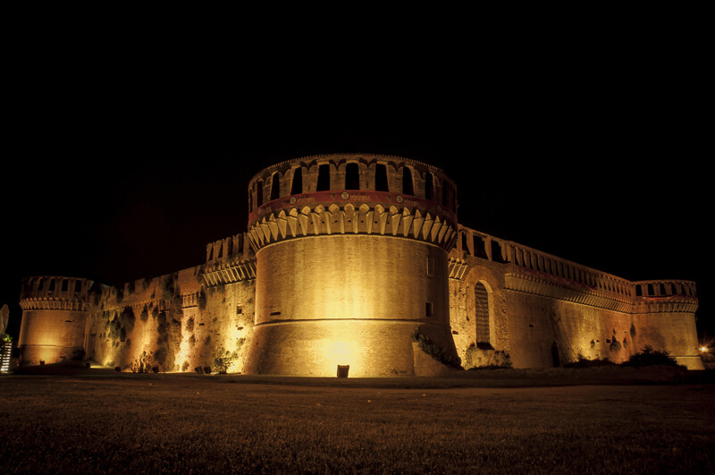

## Navigation

- 🏠 [Home](index.md)
- 📖 [Topic](topic.md)
- ⚙️ [Methodology](method.md)
- 💻 [SPARQL Queries](sparql.md)
- 🔍 [Knowledge Gap](knowledge-gap.md)
- 🔗 [RDF Triple Generation](rdf.md)
- 🤖 [LLM Comparison](llm-comparison.md)
- ⚠️ [Challenges](challenges.md)
- ✅ **Conclusion**

# Conclusion

The aim of this project was to explore the ArCo Knowledge Graph, identify meaningful semantic gaps and investigate whether Large Language Models could assist in enriching cultural heritage knowledge.

Starting from the **Rocca Sforzesca of Imola**, we progressively explored its RDF description through SPARQL queries, analysed the ArCo ontology and compared the available information with official historical sources.

This process led to the identification of two significant semantic gaps:

- the absence of the Rocca's current use as an **outdoor cinema**;
- the incomplete historical representation of the fortress, where **Caterina Sforza** is entirely absent and **Danesio Maineri** is represented as the author of the monument without distinguishing his role in the Renaissance reconstruction.

Once the gaps had been validated, Large Language Models were employed to generate candidate RDF triples capable of enriching the knowledge graph.

The experiments showed that LLMs are particularly effective when the ontology already contains suitable classes and properties, as demonstrated by the cinema use case. In contrast, the historical authorship scenario highlighted the limits of the current ontology, showing that some forms of knowledge cannot be represented correctly without extending the existing vocabulary.

Another important outcome of the project concerns the role of human supervision. Although ChatGPT and Gemini generated coherent RDF proposals, none of the generated knowledge could be accepted without manual validation against authoritative historical documentation and the ArCo ontology itself.

Overall, this project demonstrates that Knowledge Graph enrichment is a collaborative process involving SPARQL exploration, ontology analysis, historical verification and LLM-assisted knowledge generation. Rather than replacing the work of knowledge engineers, Large Language Models proved to be valuable assistants capable of accelerating the enrichment process while still requiring expert validation.

Future work could extend this methodology to other cultural heritage entities contained in ArCo, enriching the graph with additional historical relationships, cultural uses and semantic connections that are currently absent from the knowledge base.

# Final Remarks

The integration of Knowledge Graphs and Large Language Models represents a promising direction for the future of Digital Humanities.

By combining structured semantic data with the reasoning capabilities of modern language models, it becomes possible not only to discover missing knowledge, but also to propose meaningful enrichments that preserve historical consistency and semantic interoperability.

Our case study on the Rocca Sforzesca of Imola illustrates how this hybrid approach can support the continuous evolution of cultural heritage knowledge graphs while maintaining the high quality standards required by the Semantic Web community.

