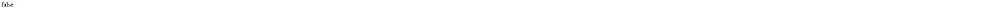

## Navigation

- 🏠 [Home](index.md)
- 📖 [Topic](topic.md)
- ⚙️ [Methodology](method.md)
- 💻 [SPARQL Queries](sparql.md)
- 🔍 **Knowledge Gap**
- 🤖 [LLM Comparison](llm-comparison.md)
- 🔗 [RDF Triples](rdf-triples.md)
- ⚠️ [Challenges](challenges.md)
- ✅ [Conclusion](conclusion.md)

# Knowledge Gap

The objective of this project was not simply to explore the [ArCo Knowledge Graph](https://dati.beniculturali.it/arco/index.php), but to identify semantic information that is currently missing or only partially represented.

After comparing the RDF data available in ArCo with official documentation from the Municipality of Imola, the Musei Civici and other institutional sources, we identified two relevant knowledge gaps concerning the Rocca Sforzesca of Imola.

## Gap 1 – Missing cultural use: Cinema

## Context

During the exploration of the `hasUse` property, we retrieved every current and historical use associated with the Rocca.

The query returned only the following functions:

- Museum
- Outdoor theatre
- Defensive bastion (historical)


_\(Query 2 results from last section\)_

As shown in the previous section, no other cultural activities are represented inside the knowledge graph.

However, according to the official website of the Musei Civici di Imola, the Rocca regularly hosts the **[Arena Cinema](https://www.roccacinema.it)**, an open-air cinema festival organised during the summer months.

Since this represents a recurring cultural activity taking place inside the Rocca, we investigated whether this information was already represented inside ArCo.

To do so we composed an ASK query (a query that can only return true or false) to see if we were absolutely correct of the information we gathered by far:

```sparql
PREFIX a-cd: <https://w3id.org/arco/ontology/context-description/>

ASK {

<https://w3id.org/arco/resource/ArchitecturalOrLandscapeHeritage/0800242914>
      a-cd:hasUse ?use .

?use a-cd:useFunction "cinema" .

}
```

### Result:

The endpoint returned:

```text
false
```



### Discussion

The query confirms that no current use corresponding to **Cinema** exists inside the ArCo Knowledge Graph.

Although temporary cultural activities are documented by the official museum website, this information has not been modelled within the knowledge graph.

This missing information limits the possibility of discovering the Rocca through semantic searches related to cultural events and entertainment activities.

---

## Gap 2 – Missing historical context

## Context

The Rocca Sforzesca is historically associated with **Caterina Sforza**, Lady of Imola and Forlì.

She ruled the city during the late fifteenth century and transformed the fortress into the political and military centre of her dominion.

Because of her importance in the history of the monument, we expected to find at least one semantic relationship connecting the Rocca with Caterina Sforza.

The previous exploration of all connected agents did not reveal any historical figure.

First we needed to verify that **Caterina Sforza** is registered into the graph with this query:

```sparql
PREFIX rdfs: <http://www.w3.org/2000/01/rdf-schema#>

ASK {
  ?person rdfs:label ?name .
  FILTER(REGEX(?name,"Caterina Sforza","i"))
  }
```

which resulted in a

```text
true
```

We therefore verified our hypothesis through another ASK query.

```sparql
PREFIX rdfs: <http://www.w3.org/2000/01/rdf-schema#>

ASK {

<https://w3id.org/arco/resource/ArchitecturalOrLandscapeHeritage/0800242914>
      ?property ?agent .

FILTER(CONTAINS(STR(?agent), "Agent"))

?agent rdfs:label ?label .

FILTER(REGEX(?label,"Caterina Sforza","i"))

}
```

### Result:

The endpoint returned:

```text
false
```


### Discussion

The absence of Caterina Sforza demonstrates that the historical context of the Rocca is only partially represented.

While the monument is accurately described from an architectural perspective, one of the most significant historical figures related to the fortress is completely absent from the semantic graph.

This limits the possibility of exploring historical relationships between monuments and historical personalities.

# Additional observation – Authorship

The exploration of the ArCo Knowledge Graph revealed that the only person explicitly connected to the Rocca through authorship is Danesio Maineri, who is associated as the architect of the Renaissance renovation commissioned during the Sforza period.


However, no semantic information is provided regarding the historical context of these interventions.

Although Danesio Maineri is correctly represented as the architect responsible for the renovation works, Caterina Sforza, who commissioned these works and whose political power is inseparably linked to the history of the fortress, is completely absent from the knowledge graph.

This means that the current modelling describes who designed the intervention, but not who commissioned or promoted it, nor the historical context in which the intervention took place.

A richer semantic representation could therefore preserve Danesio Maineri as the author of the architectural intervention while introducing an additional relationship linking the intervention (or the Rocca itself) to Caterina Sforza as its patron or historically associated ruler.

```sparql
PREFIX a-cd: <https://w3id.org/arco/ontology/context-description/>
PREFIX rdfs: <http://www.w3.org/2000/01/rdf-schema#>

ASK {

<https://w3id.org/arco/resource/ArchitecturalOrLandscapeHeritage/0800242914>
      a-cd:hasAuthor ?author .

?author rdfs:label ?name .

FILTER(REGEX(?name,"Danesio","i"))

}
```

### Result

```text
true
```

### Discussion

The query confirms that Danesio Maineri is the only author explicitly associated with the Rocca.

Although this information is technically correct, it may lead to an incomplete interpretation of the monument's history, since it does not distinguish between the original construction and the Renaissance reconstruction commissioned by the Sforza family.

---

# Summary

The comparison between ArCo and official cultural heritage sources revealed three important observations.

| Information     | Official Sources     | ArCo   |
| --------------- | -------------------- | ------ |
| Museum          | ✅                   | ✅     |
| Outdoor theatre | ✅                   | ✅     |
| Cinema          | ✅                   | ❌     |
| Caterina Sforza | ✅                   | ❌     |
| Danesio Maineri | Renovation architect | Author |

These observations demonstrate that the ArCo Knowledge Graph already provides an excellent architectural description of the Rocca Sforzesca, but some historical and cultural contextual information is still missing or only partially represented.

Such missing information could be integrated through new RDF triples, improving the semantic completeness of the knowledge graph and enabling richer historical and cultural queries.

<span style="display:block; width:100%; text-align:center; margin-top:50px; font-size:25px;">➡️ **Next:** [LLM Comparison](llm-comparison.md)</span>
