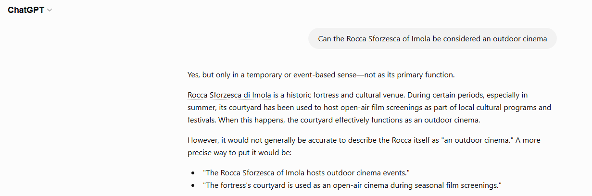
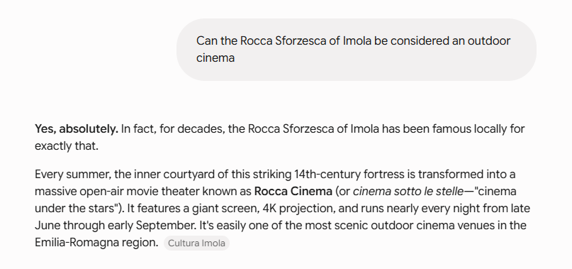
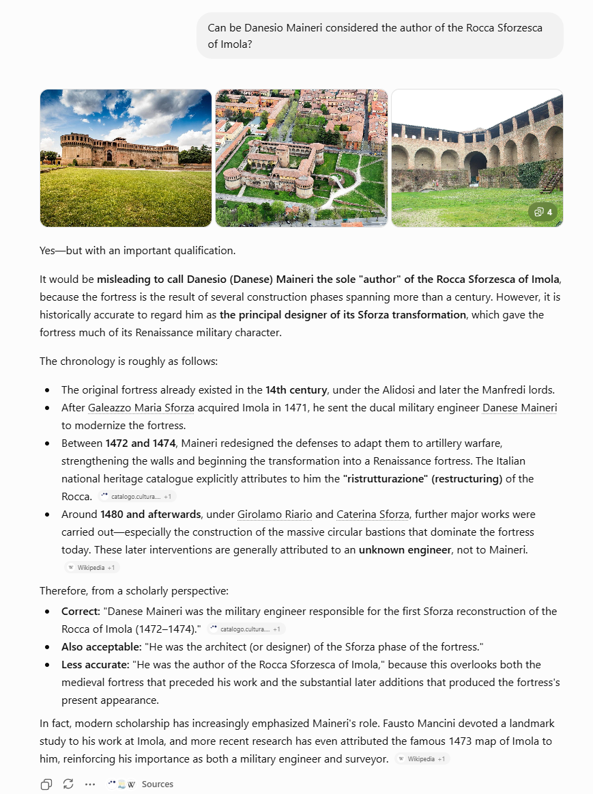
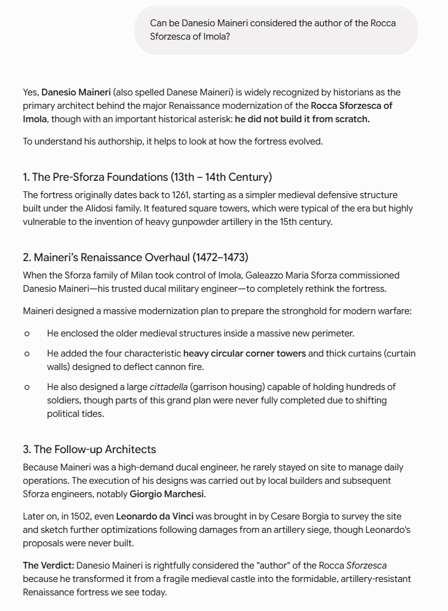
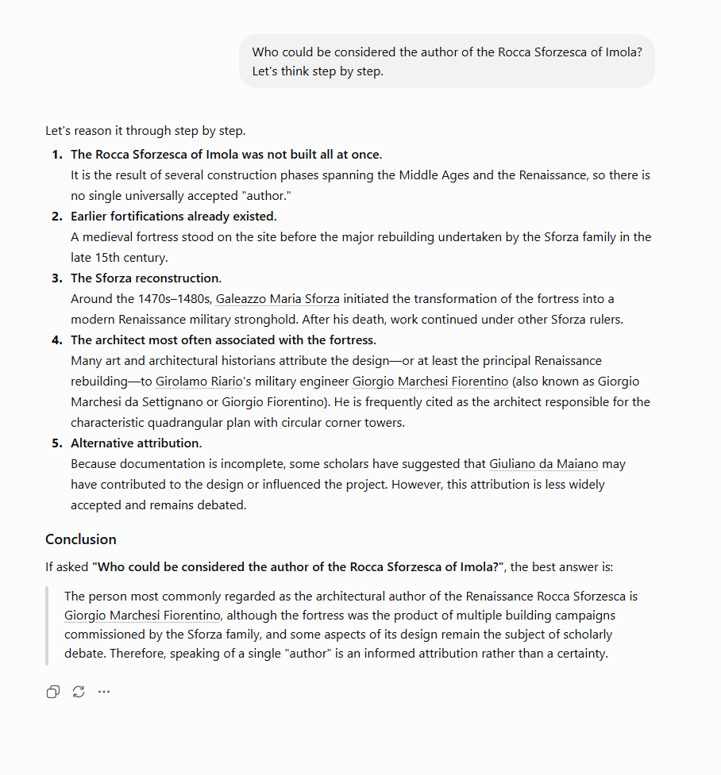
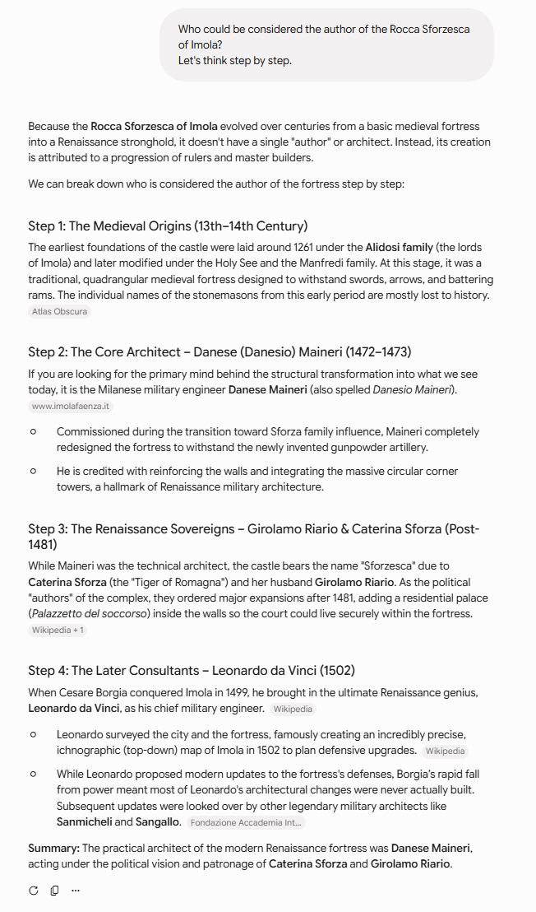

## Navigation

- 🏠 [Home](index.md)
- 📖 [Topic](topic.md)
- ⚙️ [Methodology](method.md)
- 💻 [SPARQL Queries](sparql.md)
- 🔍 [Knowledge Gap](knowledge-gap.md)
- 🤖 **LLM Comparison**
- 🔗 [RDF Triples](rdf-triples.md)
- ⚠️ [Challenges](challenges.md)
- ✅ [Conclusion](conclusion.md)

# LLM-assisted Knowledge Generation

After identifying the semantic gaps through SPARQL queries, Large Language Models were used to generate additional knowledge that could potentially enrich the ArCo Knowledge Graph.

Rather than accepting the first answer produced by the model, we experimented with different prompting techniques in order to improve the quality, precision and reliability of the generated information.

For both [ChatGPT](https://chatgpt.com) and [Gemini](https://gemini.google.com) we tested the three prompting techniques required by the project:

- Zero-shot prompting
- Few-shot prompting
- Chain-of-Thought prompting

Each answer was then manually compared with official historical sources and the ArCo ontology.

## The first gap - Missing information of the Rocca's usage

### ❓ Zero-Shot Prompting

As a first experiment, we adopted a Zero-shot prompting strategy. Since the first identified gap concerns the current uses of the Rocca, we expected the models to answer using only their internal knowledge without any additional guidance or examples.

The property a-cd:hasUse is associated with only the current cultural and historical usage of the building, so a LLM should have an easy task if the prompt is correctly written in terms of language and easy to understand in terms of tasks.

The prompt was intentionally simple:

> Can the Rocca Sforzesca of Imola be considered an outdoor cinema?

#### ChatGPT:

#### Gemini:

Both LLMs produced concise but informative answers, correctly recognising that the Rocca is also used as an outdoor cinema during the summer season.

Gemini provided a slightly richer description by emphasising the role of the Rocca not only as a historical monument but also as a cultural meeting place for the local community.

Both answers support the hypothesis that the current `a-cd:hasUse` information stored in ArCo is incomplete, since the recurring cinema activity is not represented in the knowledge graph.

The information was verified using the official website of the ["Comune di Imola" official website - (https://www.culturaimola.it/festivals/rocca-cinema-imola-il-cinema-sotto-le-stelle)](https://www.culturaimola.it/festivals/rocca-cinema-imola-il-cinema-sotto-le-stelle).

## The second gap - Incorrect information about the authors and patrons

### ❓ Few Shots Technique

The second gap concerns the authorship of the Rocca, a much more complex historical issue.

Unlike the previous experiment, we adopted a Few-shot prompting strategy by first providing the models with similar examples involving well-known Italian monuments. The goal was to guide the models towards the type of reasoning we expected before asking the actual question about the Rocca of Imola.
Before actually asking something about the Rocca of Imola, we went through some similiar subjects like:

> Who is the author of the colosseum?

> Is Arnolfo di Cambio the author of the Palazzo Vecchio in Florence?

> Can Luigi Vanvitelli be considered the author of the Royal Palace of Caserta?

and only then ask the final question about our subject.

#### ChatGPT:

#### Gemini:

Both LLMs recognised that Danesio Maineri should not simply be considered the sole author of the Rocca, but rather the architect responsible for the Renaissance reconstruction commissioned during the Sforza period.

Although the responses were richer than those obtained with Zero-shot prompting, neither model clearly distinguished between the original medieval construction of the fortress and the later Renaissance intervention.

This confirms that representing complex historical authorship through a single `hasAuthor` property may be semantically insufficient.

### ❓ Chain-of-Thought Technique

Chain-of-Thought (CoT) prompting encourages the model to explicitly articulate its intermediate reasoning steps before producing a final response. This approach has been shown to improve performance on tasks that require complex, multi-step reasoning by enabling the model to decompose problems into smaller, more manageable components. Consequently, it is particularly effective for addressing intricate or historically rich queries, such as those involving commissions with multiple participants or interconnected events.

#### ChatGPT:

#### Gemini:

Chain-of-Thought prompting produced the most detailed answers.

Both models explicitly analysed the historical development of the Rocca before identifying the role of each historical figure.

ChatGPT correctly focused on the distinction between the original medieval fortress and the Renaissance reconstruction, although it omitted Danesio Maineri in its final summary.

Gemini instead mentioned Danesio Maineri but also introduced additional historical figures, such as [Leonardo da Vinci](https://it.wikipedia.org/wiki/Leonardo_da_Vinci), whose connection with the Rocca is much weaker and potentially misleading.

Overall, Chain-of-Thought prompting generated the richest explanations, but both models still required manual verification against authoritative historical sources.

## Conclusions

The experiments show that prompt engineering has a significant impact on the quality of the information generated by Large Language Models.

- Zero-shot prompting produced quick and generally correct answers, but often lacked contextual detail.
- Few-shot prompting improved the quality of the responses by guiding the models with similar examples, resulting in more focused and coherent explanations.
- Chain-of-Thought prompting generated the most comprehensive reasoning, making it easier to identify semantic gaps and evaluate whether the generated knowledge could contribute to enriching the ArCo Knowledge Graph.

Comparing the two language models, ChatGPT generally provided more cautious and historically grounded answers, whereas Gemini tended to produce richer and more detailed explanations. However, Gemini occasionally introduced historical associations that required additional verification.

These experiments confirm that LLMs can effectively support Knowledge Engineering tasks, but their outputs should always be validated against authoritative sources and the ontology before being considered suitable for inclusion in a knowledge graph.

➡️ **Next:** [RDF Triples](rdf-triples.md)
