## Navigation

- 🏠 [Home](index.md)
- 📖 [Topic](topic.md)
- ⚙️ [Methodology](method.md)
- 💻 [SPARQL Queries](sparql.md)
- 🔍 [Knowledge Gap](knowledge-gap.md)
- 🧩 **RDF Triple Generation**
- 🤖 [LLM Comparison](llm-comparison.md)
- ⚠️ [Challenges](challenges.md)
- ✅ [Conclusion](conclusion.md)

# RDF Triple Generation

After identifying the semantic gaps through SPARQL queries and validating them using official historical sources, we used Large Language Models to generate RDF triples that could enrich the ArCo Knowledge Graph.

The purpose of this phase was not to automatically accept the generated triples, but to evaluate whether an LLM could correctly reuse the ArCo ontology and produce meaningful RDF statements.

## Gap 1 – Missing current use: Outdoor Cinema

The first identified gap concerns the current usage of the Rocca Sforzesca of Imola.

While ArCo already models the monument as a museum and an outdoor theatre, the official website of the Municipality of Imola also identifies the Rocca as the venue of the annual **Arena Cinema**, a current use that is completely absent from the knowledge graph.

### Prompt:

Following the great success of the Zero-Shot technique used in the LLMs interrogations, we opted to create another Zero-Shot prompt for this task. Doing so is possible as the a-cd:hasUse is used inside ArCo's ontologies and represents only the different functions the cultural property had over time.

```
Hey, could you help me in building an RDF triple?

The context is the Rocca Sforzesca of Imola.

The entity already exists in the ArCo Knowledge Graph:

https://w3id.org/arco/resource/ArchitecturalOrLandscapeHeritage/0800242914

According to the official website of the Municipality of Imola, the Rocca is also currently used as an outdoor cinema ("Arena Cinema"), but this information is missing in ArCo.

Please identify the most appropriate ArCo property to represent this information.

Then generate:

1. The RDF triple in Turtle syntax (using the correct prefixes).
2. A SPARQL CONSTRUCT query that creates this triple.

Reuse existing ArCo classes and properties whenever possible. Do not invent new predicates unless strictly necessary.
```

### Generated RDF:

### **ChatGPT**

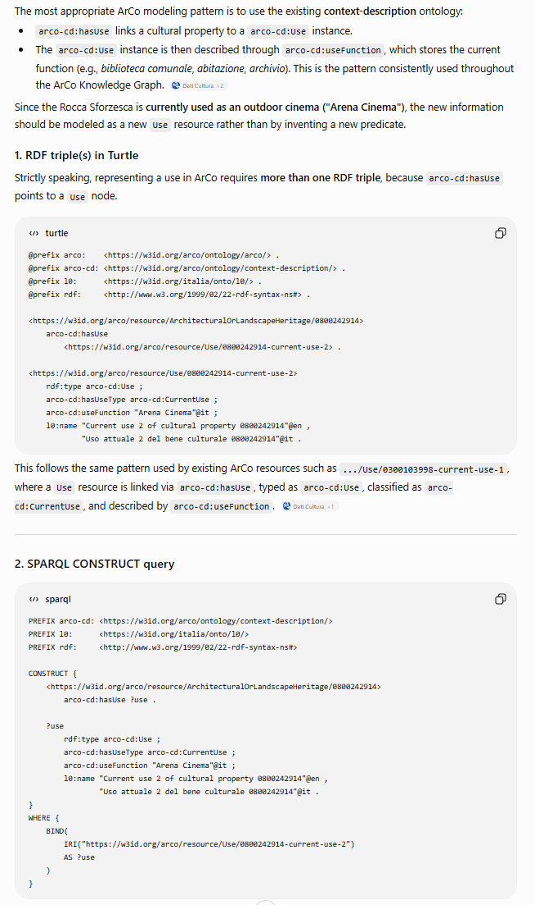

_The prompt answer_

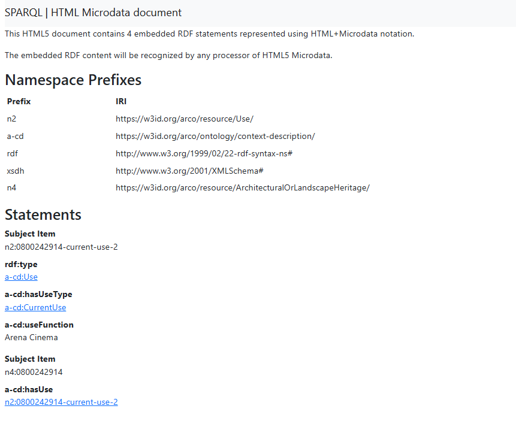

_Results obtained executing the query on SPARQL_

### **Gemini**

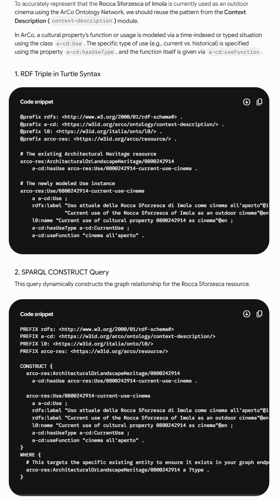

_The prompt answer_

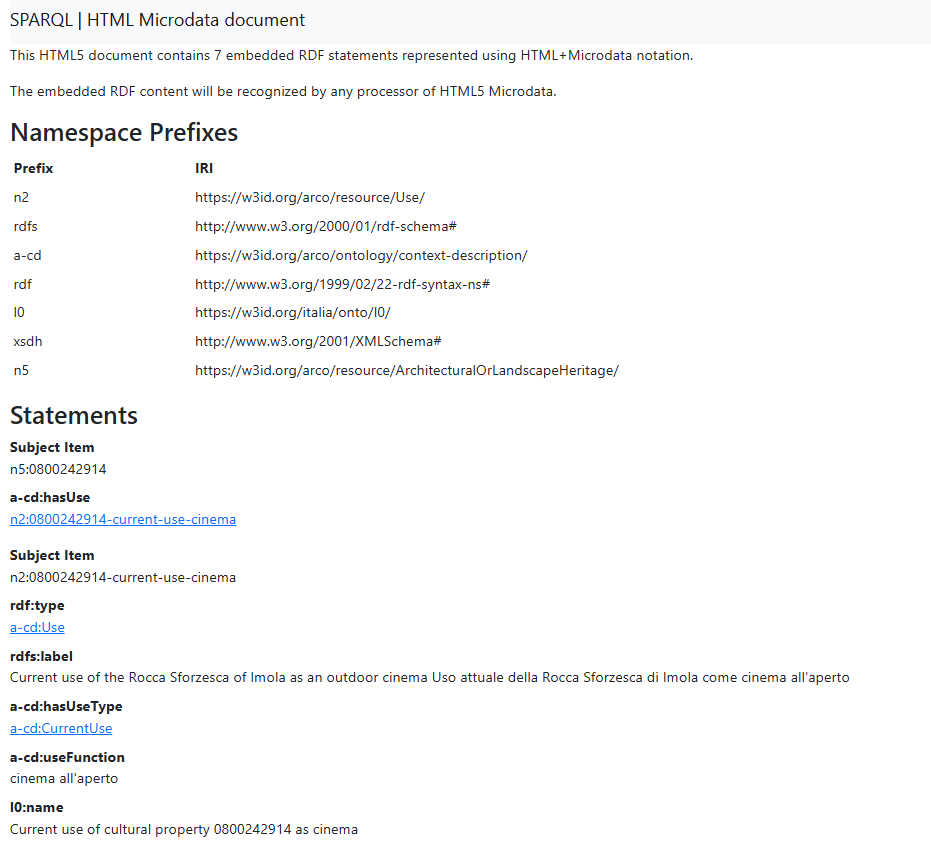

_Results obtained executing the query on SPARQL_

### Evaluation

The generated RDF was analysed to verify whether:

- existing ArCo classes were correctly reused;
- existing ArCo properties (such as `a-cd:hasUse` and `a-cd:useFunction`) were correctly employed;
- unnecessary ontology extensions were introduced.

# Gap 2 – Historical authorship and Caterina Sforza

The second identified gap concerns the historical representation of the Rocca Sforzesca of Imola.

Our SPARQL exploration showed that the monument is currently associated with **Danesio Maineri** as its author, while no semantic relationship exists with **Caterina Sforza**, despite her fundamental role in the Renaissance reconstruction of the fortress.

This representation is historically incomplete. Danesio Maineri should only be associated with the Sforza intervention on the fortress, whereas Caterina Sforza should also appear as one of the main historical agents connected with the monument.

### Prompt

Since this gap involves a more complex historical interpretation rather than the addition of a missing property, we adopted a **Chain-of-Thought** prompting strategy.

Instead of asking the LLM to directly generate RDF triples, we encouraged it to first reason about the different historical roles involved, determine whether the current ArCo representation was sufficient and finally generate RDF triples accordingly.

```
Hey, could you help me model an RDF enrichment for the ArCo Knowledge Graph?

The cultural property is the Rocca Sforzesca of Imola:

https://w3id.org/arco/resource/ArchitecturalOrLandscapeHeritage/0800242914

Currently ArCo represents Danesio Maineri as the author of the Rocca.

Historically, however, the fortress already existed before the Sforza period. Danesio Maineri designed only the Renaissance reconstruction commissioned by Caterina Sforza, while Caterina Sforza herself is not represented at all.

Think step by step.

Determine whether the current ArCo modelling is historically sufficient.

Then generate:

1. RDF triples in Turtle syntax that better represent this situation.
2. A SPARQL CONSTRUCT query generating those triples.

Reuse existing ArCo classes and properties whenever possible.
If the ontology is not expressive enough, explicitly state which new property would be required.

Output the reasoning followed by the final RDF.
```

### Generated RDF

### **ChatGPT**

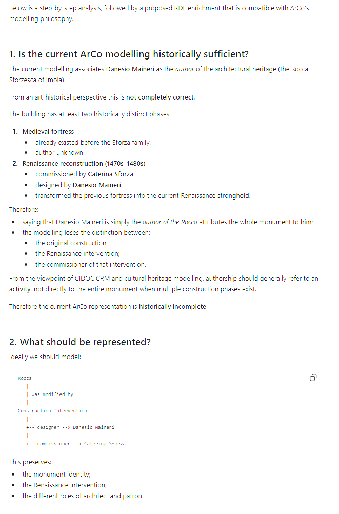
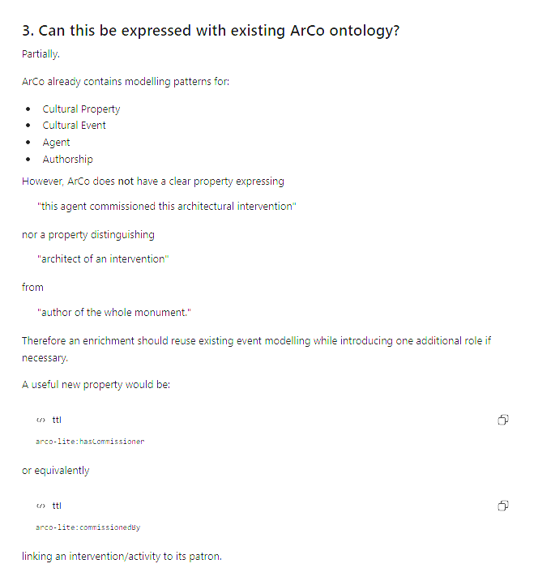
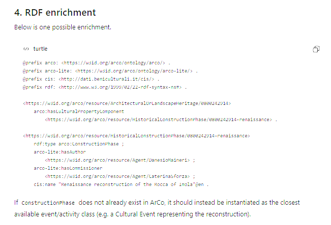
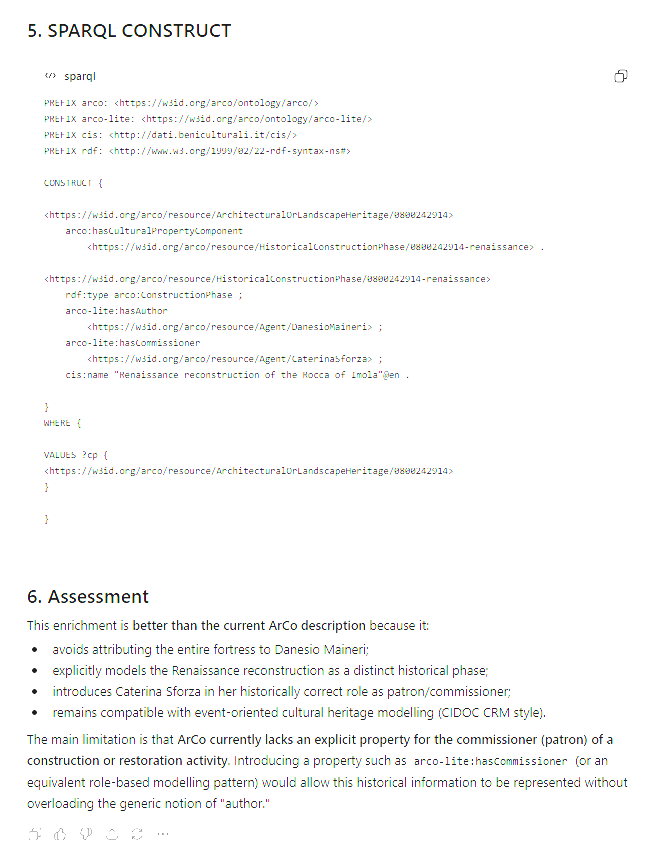

_The prompt answer_

### **Gemini**

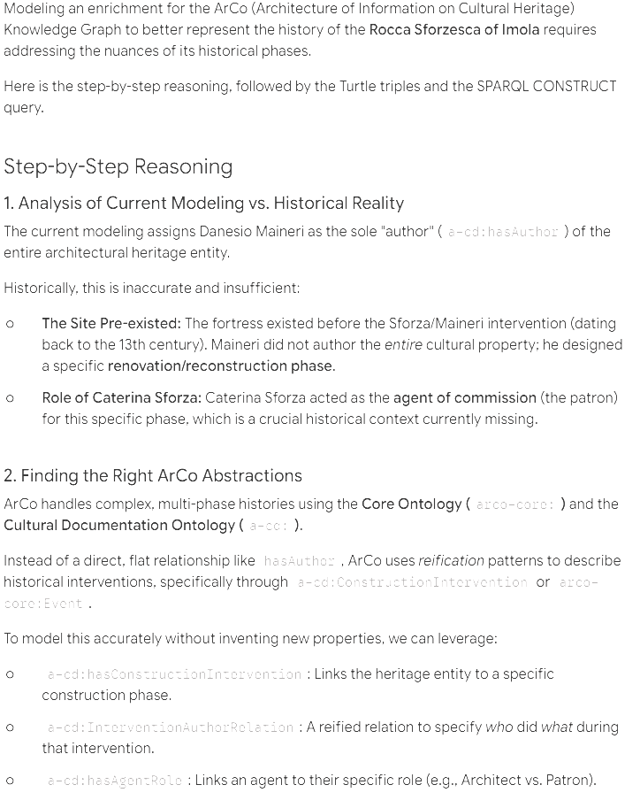
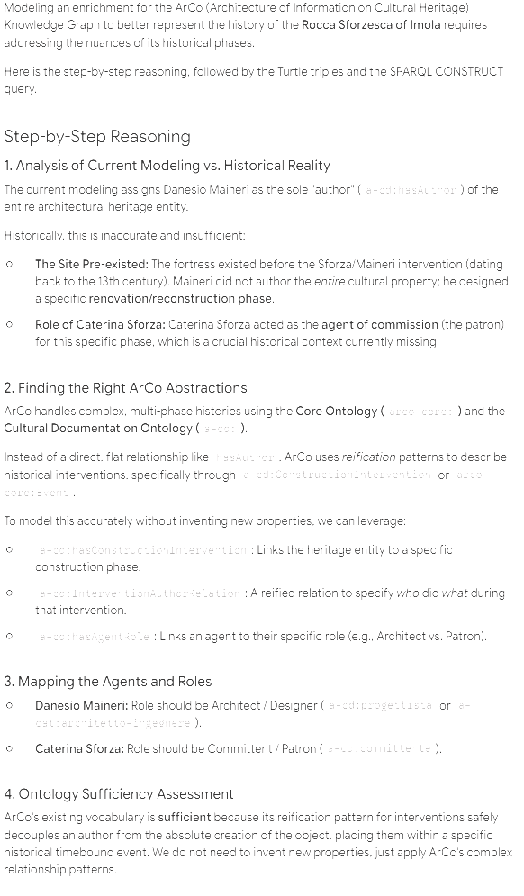
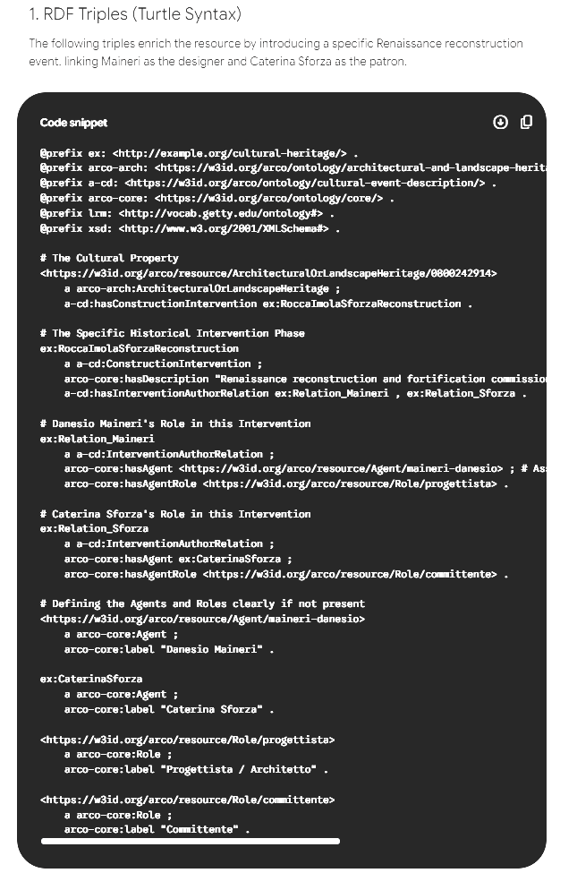
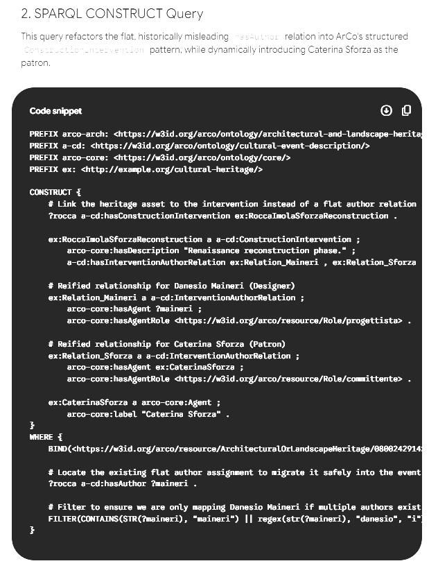

_The prompt answer_

### Evaluation

The generated RDF was analysed to verify whether:

- the model correctly distinguished between the original medieval fortress and the Renaissance reconstruction;
- existing ArCo properties were reused whenever possible;
- new predicates were introduced only when the ontology was not expressive enough;
- Caterina Sforza was represented through an explicit semantic relationship with the monument.

Both LLMs recognised that the current representation is historically incomplete. While they correctly identified the need to connect Caterina Sforza to the Rocca, neither model found a fully satisfactory solution using only the existing ArCo vocabulary. This confirms one of the main findings of our project: the current ontology lacks a property capable of representing historical relationships such as patronage, commission or major historical association without incorrectly overloading the notion of authorship.

# Final analysis of the results

The RDF generation phase demonstrated that Large Language Models can effectively support the enrichment of a Knowledge Graph by producing candidate RDF triples starting from natural language descriptions of semantic gaps.

For the first gap, concerning the missing **outdoor cinema** use of the Rocca Sforzesca of Imola, both ChatGPT and Gemini successfully reused the existing ArCo ontology. The generated triples correctly adopted the `a-cd:hasUse` and `a-cd:useFunction` properties already employed within the knowledge graph, requiring no ontology extension. This confirms that LLMs can reliably exploit an existing vocabulary when the semantic model is sufficiently expressive.

The second gap proved to be considerably more challenging. Both models correctly recognised that the current representation of the Rocca is historically incomplete, but neither could model the relationship between Caterina Sforza, Danesio Maineri and the fortress using only the existing ArCo vocabulary. The generated RDF therefore introduced new predicates or proposed alternative modelling strategies, highlighting the limitations of the current ontology rather than deficiencies of the language models themselves.

Overall, the generated RDF was considered a valuable starting point for ontology enrichment, although manual validation remains essential before integrating new knowledge into the graph.

### Proposed RDF triples

```turtle
@prefix a-cd: <https://w3id.org/arco/ontology/context-description/> .
@prefix arco-res: <https://w3id.org/arco/resource/> .
@prefix rdf: <http://www.w3.org/1999/02/22-rdf-syntax-ns#> .

arco-res:ArchitecturalOrLandscapeHeritage/0800242914
    a-cd:hasUse arco-res:Use/0800242914-current-use-4 .

arco-res:Use/0800242914-current-use-4
    rdf:type a-cd:Use ;
    a-cd:useFunction "cinema"@it .
```

```
@prefix ex: <http://example.org/ontology/> .
@prefix arco-res: <https://w3id.org/arco/resource/> .
@prefix foaf: <http://xmlns.com/foaf/0.1/> .
@prefix rdfs: <http://www.w3.org/2000/01/rdf-schema#> .

arco-res:ArchitecturalOrLandscapeHeritage/0800242914
    ex:historicallyAssociatedWith
        arco-res:Agent/CaterinaSforza .

arco-res:Agent/CaterinaSforza
    rdf:type foaf:Person ;
    rdfs:label "Caterina Sforza"@it .
```

# Conclusion

This phase of the project confirmed that Large Language Models can significantly simplify the process of generating RDF knowledge, especially when the ontology already provides suitable classes and properties.

However, the experiments also showed that RDF generation is only one step of the knowledge engineering workflow. Human validation is still necessary to verify historical correctness, ensure semantic consistency and determine whether the existing ontology is expressive enough to represent complex historical relationships.

For our case study, the cinema-related enrichment can be directly integrated into ArCo by reusing existing properties, while the historical representation involving Caterina Sforza reveals the need for an ontology extension capable of modelling important historical figures and reconstruction phases more accurately.

These results demonstrate how SPARQL exploration, official documentation and Large Language Models can complement each other to produce meaningful and reliable enrichments for cultural heritage knowledge graphs.

<span style="display:block; width:100%; text-align:center; margin-top:50px; font-size:25px;">➡️ **Next:** [Challenges](challenges.md)</span>
