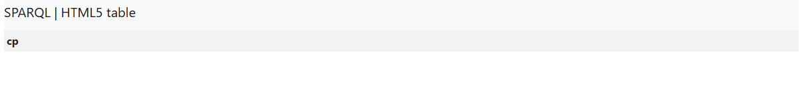
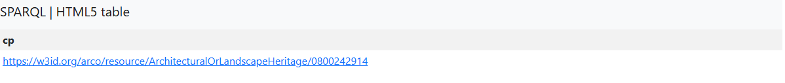
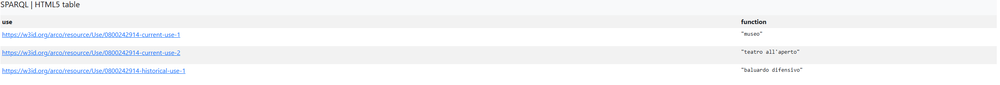
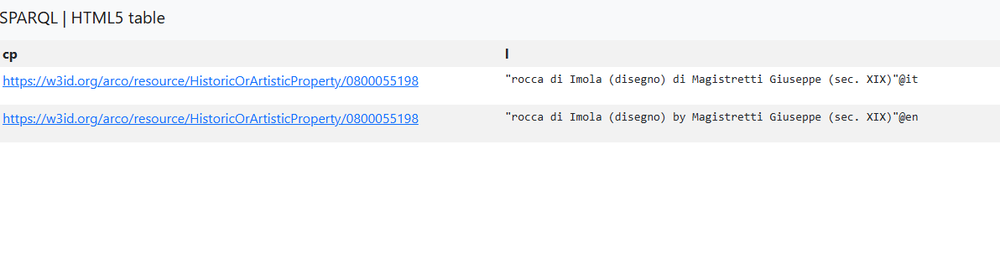
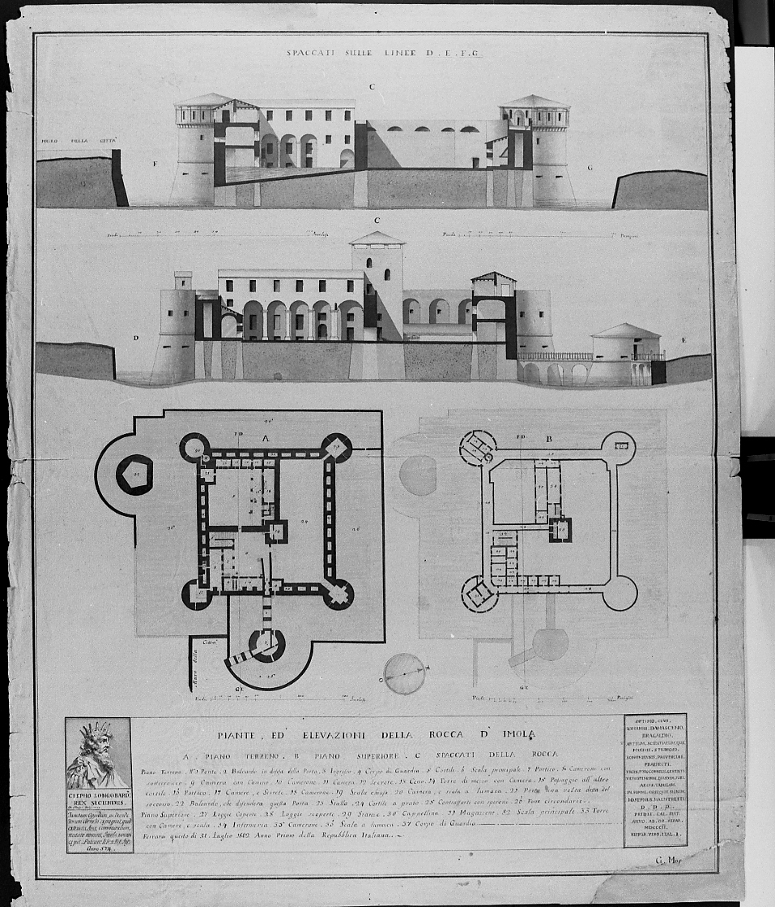
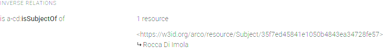
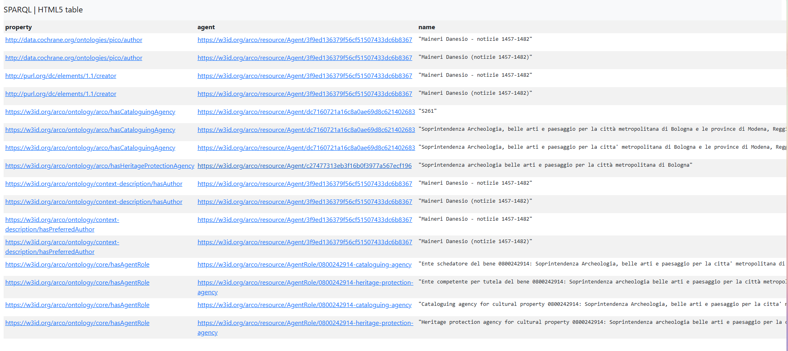

## Navigation

- 🏠 [Home](index.md)
- 📖 [Topic](topic.md)
- ⚙️ [Methodology](method.md)
- 💻 **SPARQL Queries**
- 🔍 [Knowledge Gap](knowledge-gap.md)
- 🤖 [LLM Comparison](llm-comparison.md)
- 🔗 [RDF Triples](rdf-triples.md)
- ⚠️ [Challenges](challenges.md)
- ✅ [Conclusion](conclusion.md)

# SPARQL Queries

The [ArCo Knowledge Graph](http://wit.istc.cnr.it/arco/) was explored through a series of SPARQL queries executed on the official endpoint.

The purpose of these queries was to understand how the **Rocca Sforzesca of Imola** is represented and to identify missing semantic information.

Each query addressed a specific research question and progressively explored the RDF graph.

## Query 1 — Retrieve the Rocca entity

We first tried to search for the common name of the Rocca:

```sparql
PREFIX rdf: <http://www.w3.org/1999/02/22-rdf-syntax-ns#>
PREFIX arco: <https://w3id.org/arco/ontology/arco/>
PREFIX a-cd: <https://w3id.org/arco/ontology/context-description/>

SELECT DISTINCT ?cp
WHERE {
  ?cp a arco:ArchitecturalOrLandscapeHeritage;
  rdfs:label ?l .
  FILTER(REGEX(?l, "Rocca di Imola", "i"))
}
```

but the results where somewhat dissapointing.



We then switched to a more open query in which we not onlyu searched for Rocca elements but we added a second distinct filter for Imola:

```sparql
PREFIX rdf: <http://www.w3.org/1999/02/22-rdf-syntax-ns#>
PREFIX arco: <https://w3id.org/arco/ontology/arco/>
PREFIX a-cd: <https://w3id.org/arco/ontology/context-description/>

SELECT DISTINCT ?cp
WHERE {
  ?cp a arco:ArchitecturalOrLandscapeHeritage;
  rdfs:label ?l .

  FILTER(REGEX(?l, "Rocca", "i"))
  FILTER(REGEX(?l, "Imola", "i"))
}
```

This gave us the following (and correct) result:


_[Rocca Sforzesca (rocca) - Imola (BO) - https://dati.cultura.gov.it/lodview-arco/resource/ArchitecturalOrLandscapeHeritage/0800242914.html](https://dati.cultura.gov.it/lodview-arco/resource/ArchitecturalOrLandscapeHeritage/0800242914.html)_

### Keywords used:

- DISTINCT: eliminates duplicate results.
- FILTER and REGEX: used to retrieve more specific information. FILTER restricts results based on conditions; REGEX enables pattern matching inside string values.
- cp: stands for Cultural Property.

### Query results:

We were able to find the main topic of our discussion: the Rocca Sforzesca of Imola. With a simple extraction query we then retrieved every property of the Rocca entity, and all listed in **[this link](https://dati.cultura.gov.it/sparql?default-graph-uri=&query=SELECT+%3Fproperty+%3Fvalue%0D%0AWHERE+%7B%0D%0A%0D%0A<https%3A%2F%2Fw3id.org%2Farco%2Fresource%2FArchitecturalOrLandscapeHeritage%2F0800242914>%0D%0A++++++%3Fproperty+%3Fvalue+.%0D%0A%0D%0A%7D%0D%0AORDER+BY+%3Fproperty&format=text%2Fhtml&timeout=0&signal_void=on)**.

```sparql
SELECT ?property ?value
WHERE {

<https://w3id.org/arco/resource/ArchitecturalOrLandscapeHeritage/0800242914>
      ?property ?value .

}
ORDER BY ?property
```

This results provides the complete RDF description of the monument and represents the starting point for the semantic analysis.

## Query 2 - Current and historical uses

The following query retrieves every current and historical use associated with the Rocca.

```sparql
PREFIX a-cd: <https://w3id.org/arco/ontology/context-description/>

SELECT ?use ?function
WHERE {
  <https://w3id.org/arco/resource/ArchitecturalOrLandscapeHeritage/0800242914>
      a-cd:hasUse ?use .
  ?use a-cd:useFunction ?function .
}
```

This query targets only the Rocca entity and returns all the use functions of the object.



### Query results:

The knowledge graph currently describes the following uses:

- Museum
- Outdoor theatre
- Defensive bastion (historical)

These results will later be compared with official documentation.

## Query 3 - Expanding possible resources not yet related

In this query our goal was to retrieve informations about possible art or photographical evidence of the Rocca Sforzesca that might not already be correletad or contained in the Rocca entity. To do so, we opted to unite various **[ArCo Classes](http://wit.istc.cnr.it/arco/lode/extract?lang=en&url=https://raw.githubusercontent.com/ICCD-MiBACT/ArCo/master/ArCo-release/ontologie/arco/arco.owl)** using the UNION keyword.

```sparql
PREFIX rdf: <http://www.w3.org/1999/02/22-rdf-syntax-ns#>
PREFIX arco: <https://w3id.org/arco/ontology/arco/>
PREFIX a-cd: <https://w3id.org/arco/ontology/context-description/>

SELECT DISTINCT *
WHERE {
 {
    ?cp a arco:HistoricOrArtisticProperty ;
      rdfs:label ?l .
    FILTER(REGEX(?l, "Rocca", "i"))
    FILTER(REGEX(?l, "Imola", "i"))
  }
  UNION
  {
    ?cp a cis:GraphicOrCartographicDocumentation;
      rdfs:label ?l .
    FILTER(REGEX(?l, "Rocca", "i"))
    FILTER(REGEX(?l, "Imola", "i"))
  }
  UNION
  {
    ?cp a cis:MovableCulturalProperty  ;
      rdfs:label ?l .
    FILTER(REGEX(?l, "Rocca", "i"))
    FILTER(REGEX(?l, "Imola", "i"))
  }
  UNION
  {
    ?cp a cis:PhotographicHeritage  ;
      rdfs:label ?l .
    FILTER(REGEX(?l, "Rocca", "i"))
    FILTER(REGEX(?l, "Imola", "i"))
  }
}

LIMIT 100
```

With a single result, but duplicated in two languages, we found the following:



_[Rocca di Imola (disegno) by Magistretti Giuseppe (sec. XIX) - https://dati.cultura.gov.it/lodview-arco/resource/HistoricOrArtisticProperty/0800055198.html](https://dati.cultura.gov.it/lodview-arco/resource/HistoricOrArtisticProperty/0800055198.html)_

### Keywords used:

- UNION: Combines results from two different graph patterns, like [HistoricOrArtisticProperty](http://wit.istc.cnr.it/arco/lode/extract?lang=en&url=https://raw.githubusercontent.com/ICCD-MiBACT/ArCo/master/ArCo-release/ontologie/arco/arco.owl#d4e4837) and [MovableCulturalProperty](http://wit.istc.cnr.it/arco/lode/extract?lang=en&url=https://raw.githubusercontent.com/ICCD-MiBACT/ArCo/master/ArCo-release/ontologie/arco/arco.owl#d4e5087):
- \* (Asterisk): Retrieves every variable defined within the WHERE clause for each match, rather than limiting the output:
- LIMIT X: Limits the list of results to X records.

### Query results:

The only two records returned are the same drawing of the Rocca from the 14th century, in which we can only depict the similarities of the building with today. In the inverse relatios we can find that the Rocca is referenced so we will continue our research through the queries.



## Query 4 - Finding all the agents

In this query we wanted to search for all possible agents that are registered under the Rocca Entity.
To verify whether historical figures were explicitly represented, all connected agents were retrieved.

```sparql
PREFIX rdfs: <http://www.w3.org/2000/01/rdf-schema#>

SELECT DISTINCT ?property ?agent ?name
WHERE {

  <https://w3id.org/arco/resource/ArchitecturalOrLandscapeHeritage/0800242914>
      ?property ?agent .

  FILTER(CONTAINS(STR(?agent), "Agent"))

  OPTIONAL {
      ?agent rdfs:label ?name .
      FILTER(LANG(?name) = "it" || LANG(?name) = "en" || LANG(?name) = "")
  }

}
ORDER BY ASC ?property
```



### Keywords used:

- OPTIONAL: Allows the inclusion of supplementary data (in this case, rdfs:label) if it exists, without excluding results where the image information is missing
- ORDER BY ASC: sorts the output alphabetically according to the property URI

### Query results:

Besides the author of the building, [Danesio Maineri](https://it.wikipedia.org/wiki/Danese_Maineri) only institutional agents and cataloguing authorities were found.
No historical person such as **Caterina Sforza** is directly represented.
This information is already not correct, as the author of the Rocca is not correlated to Danesio Maineri but only to the renovations made during the Sforza reign.

## Research conclusion

After all the queries that we have highlighted, we can draw several key conclusions:

- [Rocca Sforzesca of Imola](https://dati.cultura.gov.it/lodview-arco/resource/ArchitecturalOrLandscapeHeritage/0800242914.html) exists as a distinct entity within the ontology. Some of the resources we found might not be truthful or 100% correct.
- There are no signs of relevant historical figures (agents) that contributed to the Rocca of Imola and that are key properites that might need to be adjusted.

<span style="display:block; width:100%; text-align:center; margin-top:50px; font-size:25px;">➡️ **Next:** [Knowledge Gap](knowledge-gap.md)</span>
