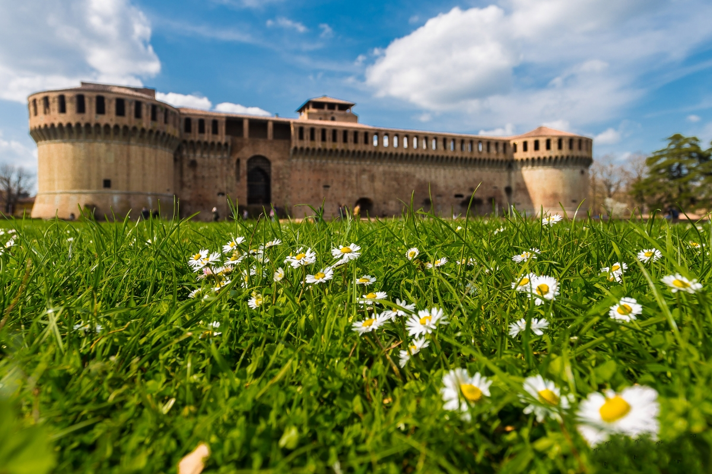
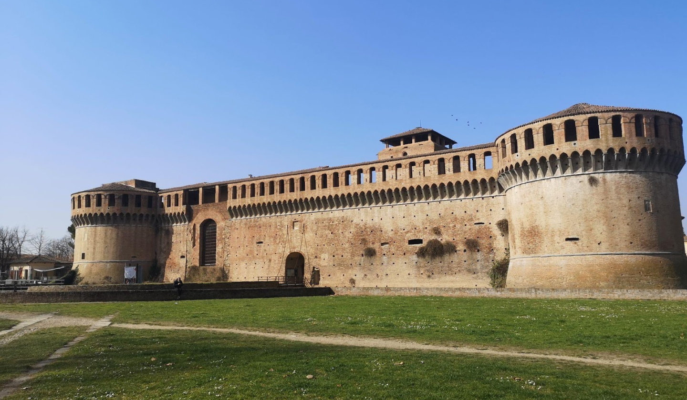
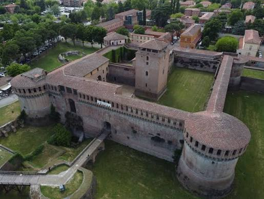
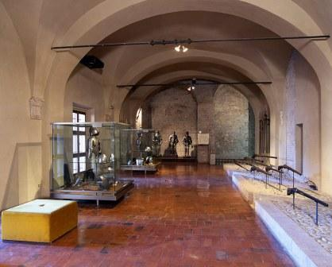

## Navigation

- 🏠 [Home](index.md)
- 📖 **Topic**
- ⚙️ [Methodology](method.md)
- 💻 [SPARQL Queries](sparql.md)
- 🔍 [Knowledge Gap](knowledge-gap.md)
- 🤖 [LLM Comparison](llm-comparison.md)
- ⚠️ [Challenges](challenges.md)
- ✅ [Conclusion](conclusion.md)

# The Rocca Sforzesca of Imola

## Overview

The **Rocca Sforzesca of Imola** is one of the best-preserved fortified buildings in Northern Italy and represents an important example of the transition between medieval military architecture and Renaissance fortification systems.

Its origins date back to the **13th century**, when the Municipality of Imola commissioned the construction of a fortress to defend the city. During the following centuries the building underwent several transformations under the rule of different noble families, including the Alidosi, the Visconti, the Manfredi and finally the Sforza family. Between **1472 and 1484** the fortress was extensively redesigned in order to withstand the introduction of firearms, giving the Rocca the characteristic appearance that can still be appreciated today.

_View of the Rocca Sforzesca of Imola._

_Aereal view of the fortress._

## Historical Background

Throughout its history, the Rocca played both military and political roles.

One of its most famous historical figures is **Caterina Sforza**, Lady of Imola and Forlì, who lived in the fortress together with her husband **[Girolamo Riario](https://it.wikipedia.org/wiki/Girolamo_Riario)**. During her rule the Rocca became the political centre of the city and symbolised the power of the Riario-Sforza family.

Following the death of Pope Sixtus IV and the political instability that followed, the fortress was besieged by **[Cesare Borgia](https://it.wikipedia.org/wiki/Cesare_Borgia)** in 1499, marking the end of Caterina Sforza's dominion over Imola.

## The Rocca Today

Today the Rocca Sforzesca is managed by the [Civic Museums of Imola](https://imolamusei.it/rocca-sforzesca/) and functions as an important cultural institution.

The museum hosts two permanent collections:

- Weapons collection (13th–19th century)
- Archaeological ceramics discovered during the restoration campaigns of the 1960s

Visitors can explore towers, walkways, prisons, underground rooms and the keep while learning about the architectural evolution of the fortress from the Middle Ages to the Renaissance.

_The museum inside the Rocca._

## Why was this monument selected?

The Rocca Sforzesca represents an ideal case study for Knowledge Engineering because:

- it is described within the ArCo Knowledge Graph;
- it is extensively documented by authoritative cultural heritage sources;
- it is strongly connected with important historical figures and cultural activities;

These characteristics make it particularly suitable for analysing the completeness of a cultural heritage knowledge graph and proposing semantic enrichments.

➡️ **Next:** [Methodology](method.md)
